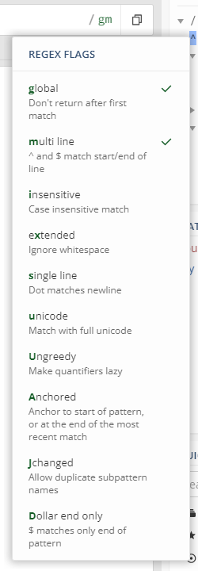

### 플래그

* 플랫폼 종속적인 기능
* 플랫폼에 따라 제공 되는지 결정 됨
    * 리눅스 `grep`

| g    | global         | Match as may times as you can     |
| ---- | -------------- | --------------------------------- |
| m    | multi-line     | match ^ and $                     |
| i    | case-insentive | lower and upper case              |
| s    | single line    | `.` 새로운 라인을 제외한 모든문자 |

예시)

```js
// 하나이상의 공백 문자들을 각 라인의 처음에 매치시킴
// `g`는 가능한 많이 매치
// 'm'은 각 라인에서 찾음
const regex = /^\s+/gm
```


