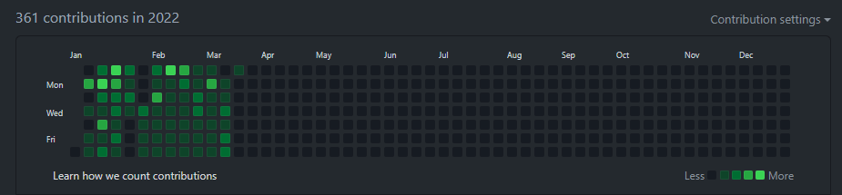
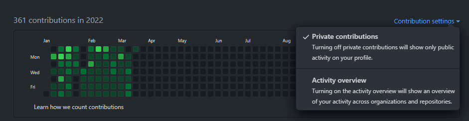
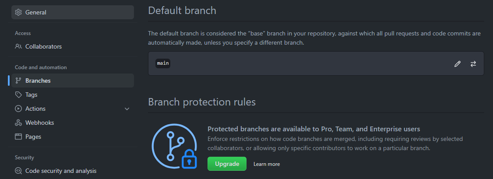
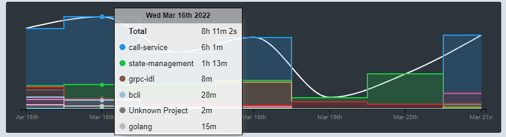
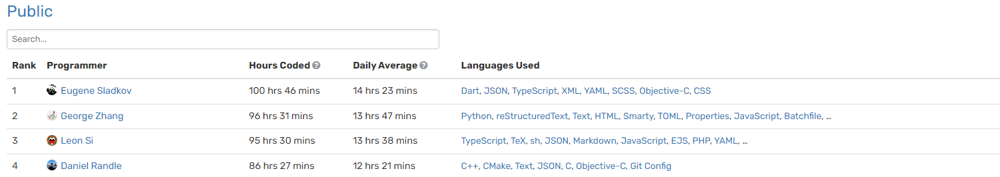

저는 매일 매일 잔디를 심어야겠다까지는 아니지만 최선을 다해서 `github`에 잔디를 심고 있습니다. 어느 날 갑자기 제가 심은 잔디가 보이지 않는 현상을 발견했습니다😫

제 잔디는 어디갔을까요..?😑 잃어버린 잔디를 확인하기 위해서는 2가지를 확인하셔야 됩니다!

### 1. Private Repository

많이들 아시겠지만 따로 설정해주지 않으면 `private repositiory`는 github 배너에서 확인할 때 보이지 않습니다.

다음과 같이 `Private contribution`항목이 체크되어 있는지 확인해주세요!

### 2. Default Branch

위에 설정 및 내 브랜치는 `public`인데 주말에 작업한 내역이 보이지 않는다! 이럴땐 `default branch`를 확인하셔야됩니다.

이 때 `default branch`를 제가 작업한 브랜치로 바꾸어주면 잔디가 심어져있는 것을 확인 할 수 있습니다.

하지만 언젠가 `main`브랜치로 `merge`하면 우리의 비어져있던 잔디도 채워질 수 있습니다.

### wakatime

github으로 내가 작업한 성과들을 확인할 수 있지만 정말 내가 어떤 언어를 사용하여 개발하고, 얼마나 많은 시간을 투자하는지 확인하기 위해서는 `wakatime`만큼 좋은게 없다고 생각합니다. 그래서 공유드립니다!

### 마치며

기업에서 `github`에 잔디를 보면서 많은 분들이 잔디를 열심히 심고 계십니다. 저는 개인적으로 `wakatime`에 랭커들을 보면서 많은 동기부여를 얻고 그로인해 좀 더 잔디 심을때 의욕이 생기더라구요! 일이 즐거움이 될 수 있게 화이팅해봅니다 아자아자👍👍👍
