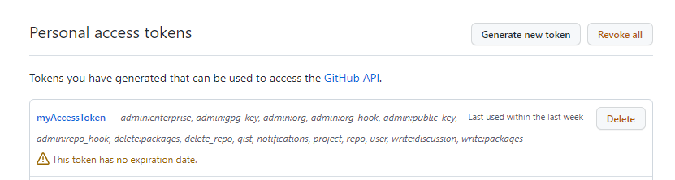
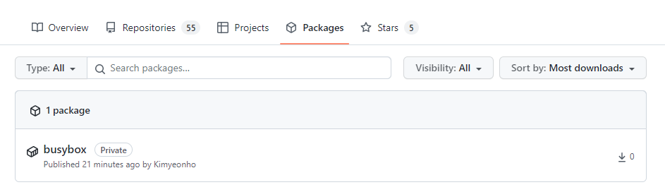

#### Github에 Container registry 등록하기

github에 container를 등록하여 사용할 수 있습니다. 어떻게 하는지 알아 보도록 합시다.

1. Access Token을 발급한다 (Setting > Developer setting > Personal access tokens)




**패키지에 대한 `write`옵션이 켜져 있어야 합니다.**

2. docker 로그인

```bash
$ echo "{token}" | docker login ghcr.io -u kyh0703 --password-stdin
WARNING! Your password will be stored unencrypted in /home/rke/.docker/config.json.
Configure a credential helper to remove this warning. See
https://docs.docker.com/engine/reference/commandline/login/#credentials-store

Login Succeeded
```

3. docker image push

```bash
$ docker image push ghcr.io/kyh0703/busybox:latest
The push refers to repository [ghcr.io/kyh0703/busybox]
7ad00cd55506: Preparing 
denied: permission_denied: The token provided does not match expected scopes.
# write 권한이 없으면 위와 같이 표기됩니다.

$ docker image push ghcr.io/kyh0703/busybox:latest
The push refers to repository [ghcr.io/kyh0703/busybox]
7ad00cd55506: Pushed 
latest: digest: sha256:dcdf379c574e1773d703f0c0d56d67594e7a91d6b84d11ff46799f60fb081c52 size: 527
```

4. 이미지 확인



#### 마치며

사이드 프로젝트를 할 때 `github container registry`를 사용하여 사용하면 좋을 것 같다는 생각이 드는 하루입니다😎
