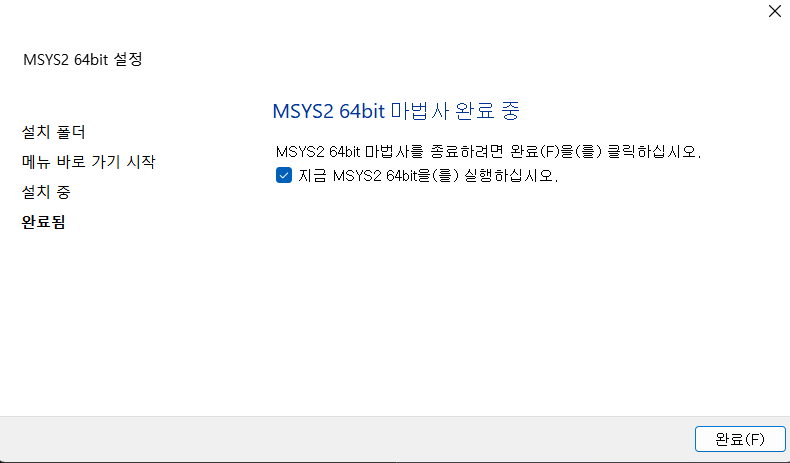
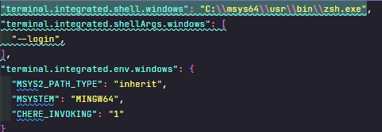

윈도우에서 `gcc` 빌드라던가 리눅스 환경처럼 꾸며주면 평소 작업을 원활하게 할 수 있습니다. 어떻게 하는지 알아봅시다.

먼저 `MYSYS2`를 설치하여 주세요!😤

- MYSYS2 설치



MYSYS2를 먼저 설치합니다!

- MYSYS Inherit 설정

```bash
C:\msys64\mingw64.ini

#MSYS=winsymlinks:nativestrict
#MSYS=error_start:mingw64/bin/qtcreator.exe|-debug|<process-id>
#CHERE_INVOKING=1
MSYS2_PATH_TYPE=inherit
MSYSTEM=MINGW64
```

- Window Terminal `MYYS2` 추가

```bash
# setting.json

# powerlevel 10k
"defaults": {
    "font": {
    	"face": "MesloLGS NF"
    }
},
# MSYS2
list: [
    {
        "guid": "{71160544-14d8-4194-af25-d05feeac7233}",
        "name": "MSYS / MSYS2",
        "commandline": "C:/msys64/msys2_shell.cmd -defterm -here -no-start -msys -use-full-path -shell zsh",
        "startingDirectory": "C:/msys64/home/%USERNAME%",
        "icon": "C:/msys64/msys2.ico",
    }
]
```

- 패키지 설치

```bash
pacman -Syu
```

- gcc 설치

```bash
pacman -S mingw-w64-x86_64-gcc
```

- zsh 설치

```bash
pacman -S zsh
```

- vim 설치

```bash
pacman -S vim
```

- Oh my zsh 설치

```bash
sh -c "$(curl -fsSL https://raw.githubusercontent.com/robbyrussell/oh-my-zsh/master/tools/install.sh)"
```

- [powerlevel10k](https://github.com/romkatv/powerlevel10k#installation) 설치

```bash
git clone --depth=1 https://github.com/romkatv/powerlevel10k.git ~/powerlevel10k
echo 'source ~/powerlevel10k/powerlevel10k.zsh-theme' >>~/.zshrc
```

- ~/.zsh 변경

```bash
# ~/.zshrc
ZSH_THEME=powerlevel10k/powerlevel10k

alias vi="vim"

```

- vscode 설정

  

- 설치 확인
