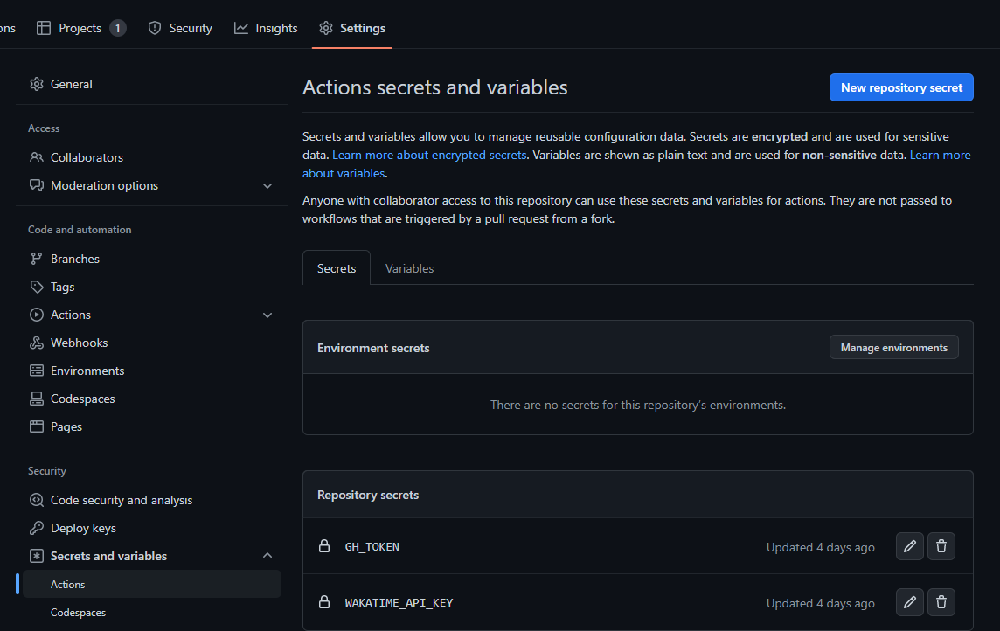

#### README 파일 추가

```bash
<!--START_SECTION:badges-->
<!--END_SECTION:badges-->
```

#### Secret 추가



#### Action 설정

```yaml
name: Update Readme Actions
on:
  schedule:
    - cron: '30 18 * * *'
  workflow_dispatch:
jobs:
  update-readme:
    name: Update Readme with Metrics
    runs-on: ubuntu-latest
    steps:
      - name: Badges - README
        uses: pemtajo/badge-readme@main
        with:
          CREDLY_USER: "kim-yeonho"
```

> CREDLY_USER는 "credly" https://www.credly.com/users/{user} 로 검색하여 나오는 본인의 아이디를 넣어줍니다.
