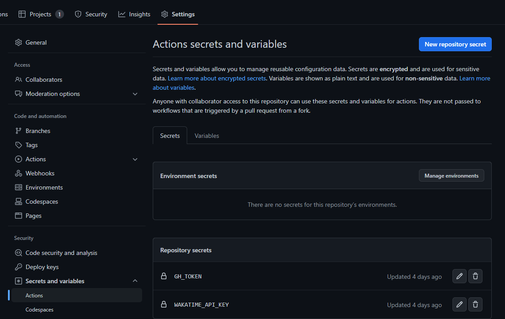

#### README 파일 추가

```bash
<!--START_SECTION:waka-->
<!--END_SECTION:waka-->
```

#### Secret 추가



#### Action 설정

```yaml
name: Update Readme Actions
on:
  schedule:
    - cron: '30 18 * * *'
  workflow_dispatch:
jobs:
  update-readme:
    name: Update Readme with Metrics
    runs-on: ubuntu-latest
    steps:
      - name: WakaTime - README
        uses: anmol098/waka-readme-stats@master
        with:
          WAKATIME_API_KEY: ${{ secrets.WAKATIME_API_KEY }}
          GH_TOKEN: ${{ secrets.GH_TOKEN }}
          LOCALE: "ko"
          SHOW_LINES_OF_CODE: "True"
          SHOW_PROFILE_VIEWS: "False"
          SHOW_DAYS_OF_WEEK: "False"
          SHOW_SHORT_INFO: "False"
          SHOW_LOC_CHART: "False"
          SHOW_PROJECTS: "False"
          SHOW_LANGUAGE_PER_REPO: "False"
```
